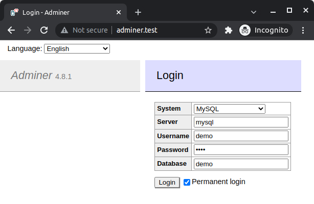
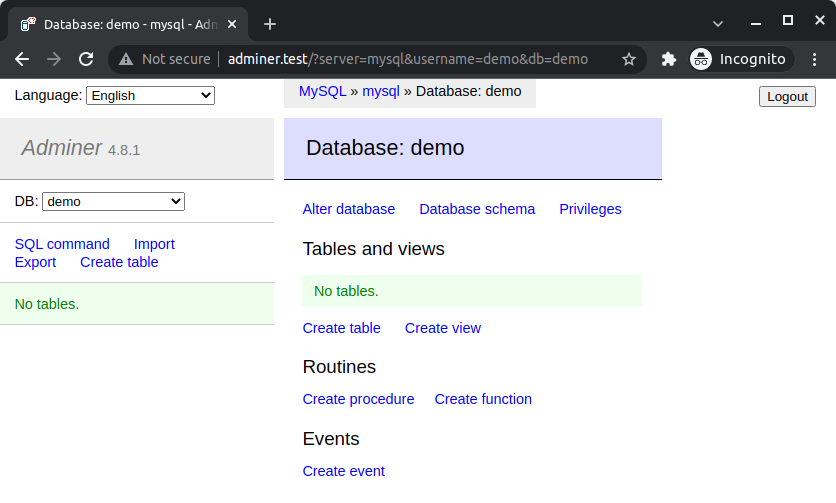

# React + Laravel = show list of addresses

**PHP 8.1 + MySQL 8 + Nginx 1.21.4 + Adminer**

## Setup

See definitions in the `.env` files.

Add to `/etc/hosts` file lines:

```
127.0.0.1 adminer.test
```

install node modules for React local testing

```
cd frontend
npm install
```

## Docker

start all necessary containers:

```
docker-compose up --build
```

## Database

### For Adminer





## Pre-launch

Create database and prefill it with testing fake data:

```
php artisan migrate
php artisan db:seed
```

## Test

```
php artisan test
```

## Launch

Front-end is built in React

```
http://localhost:3000/
```

all API calls are made to backend using `Header:Authorization` key. The value of this keys is retrived from `.env` files from both projects (Laravel & React) and it must be matching. User's uuid is stored in localStorage 
